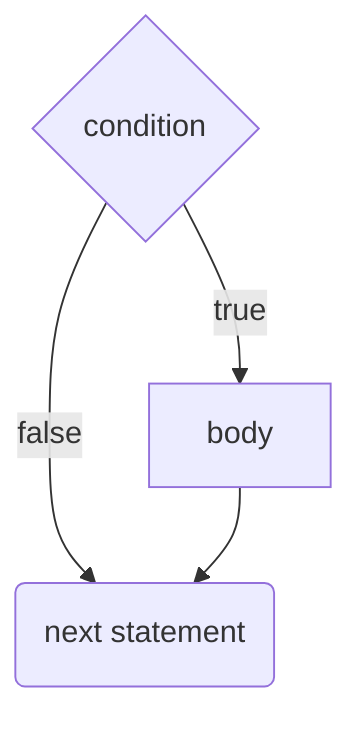
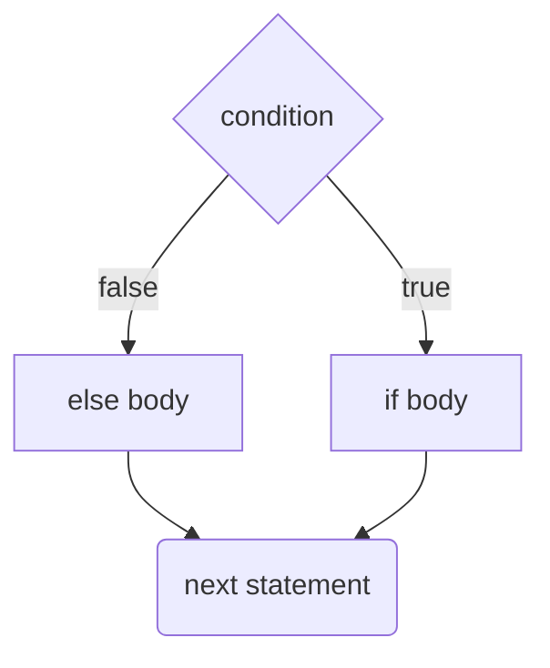
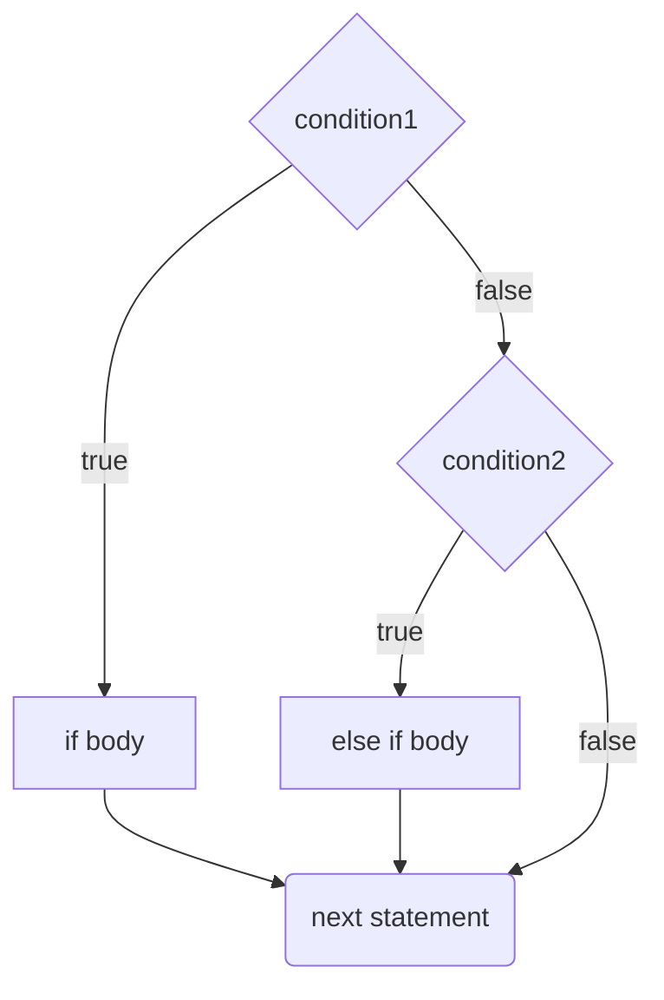

# Logic
## `if`
```java
if (condition) {
	// body
}
// next statement
```

The statements inside the body are executed if condition is `true`. condition is a `boolean` expression.



### `else`
```java
if (condition) {
	// if body
} else {
	// else body
}
// next statement
```
The `else` body gets executed if `condition` is false.



### `else if`
```java
if (condition1) {
	// if body
} else if (condition2) {
	// else if body
}
```



You can chain `else if`s and end in an `else`.

```java
if (condition1) {
	// executed if condition1 is true
} else if (condition2) {
	// executed if condition1 is false and condition2 is true
} else if (condition3) {
	// executed if condition1 and condition2 are false and condition3 is true
} else {
	// executed if condition1, condition2, and condition3 are false
}
```

## `switch`
A switch statement is like a bunch of if statements.

```java
switch (value) {
	case 1:
		// executed if value is 1
		break;
	case 2:
	case 3:
		// executed if value is 2 or 3
		break;
	default:
		// executed otherwise
}
```

`value` can either be a number, a `boolean`, a `String`, or a `char`.

