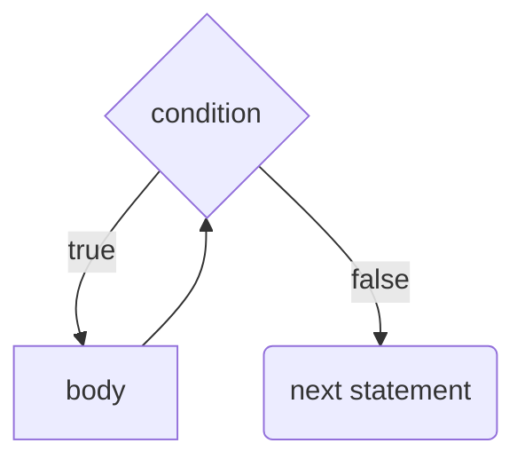
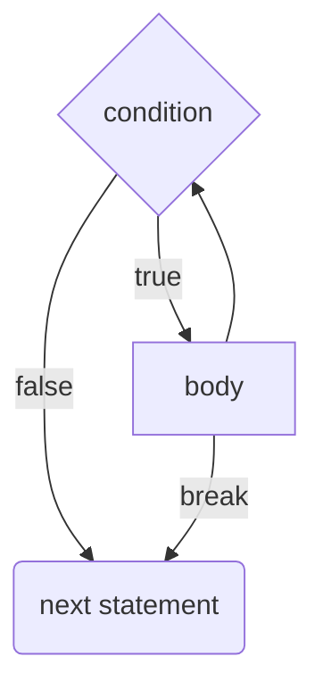
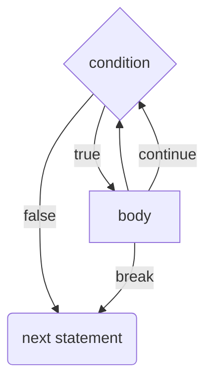
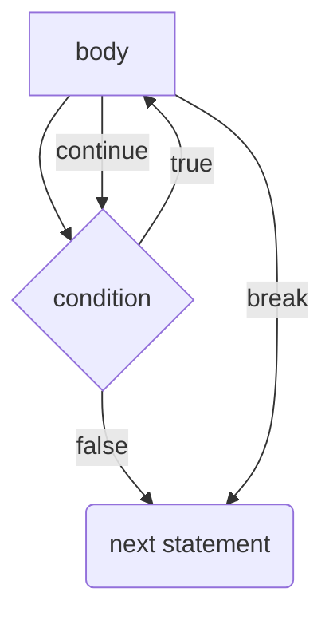

# `while` Loops
A `while` loop executes a set of statements until a given condition becomes false.

```java
while (condition) {
	// body
}
```



## `break`
A `break` statement causes the computer to exit from `while` loop early and continue on to the next statement.

```java
break;
```



## `continue`
A `continue` statement causes the computer to jump to the beginning of the `while` loop.
```java
continue;
```



## `do`...`while` Loop
The `do`...`while` loop is like a `while` loop except it executes the body *before* checking for the condition.

```java
do {
	// body
} while (condition);
```




