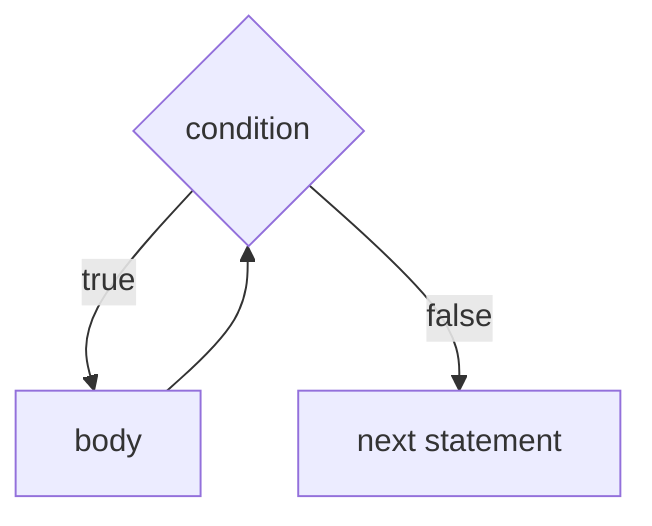
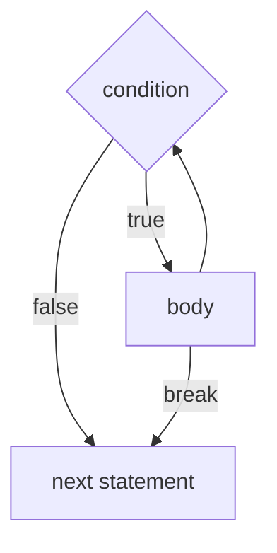
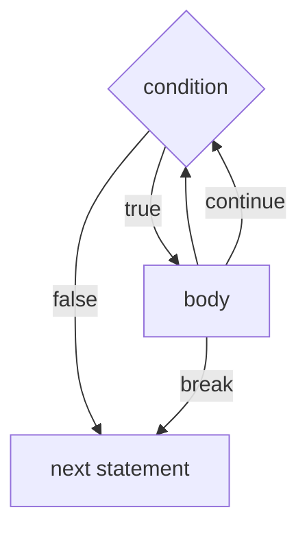
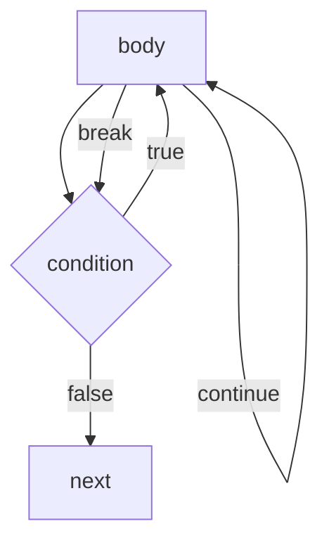
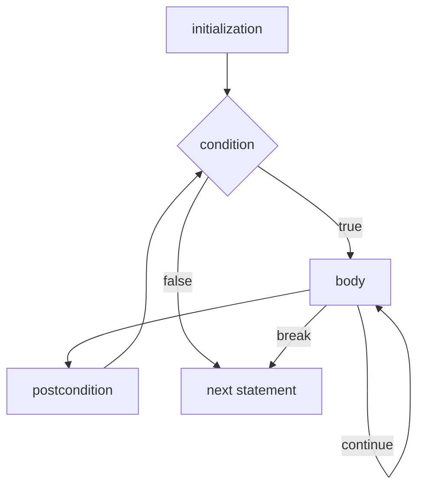

# Loops
There are four kinds of loops: `while`, `do`...`while`, `for`, and for-each, which will be covered later.

## `while`
```java
while (condition) {
	// body
}
```
Executes body if condition is `true`. Repeat.



### `break` statements
```java
break;
```
can be placed inside of a `while` loop to end the loop early.



### `continue` statements
```java
continue;
```
can be placed inside a `while` loop to skip the body and start over.



## `do`...`while`
```java
do {
	// body
} while (condition);
```

Executes body, then repeat if condition is `true`.



## `for`
```java
for (initialization; condition; postcondition) {
	// body
}
```

condition is a `boolean` expression. initialization and postcondition are statements.



