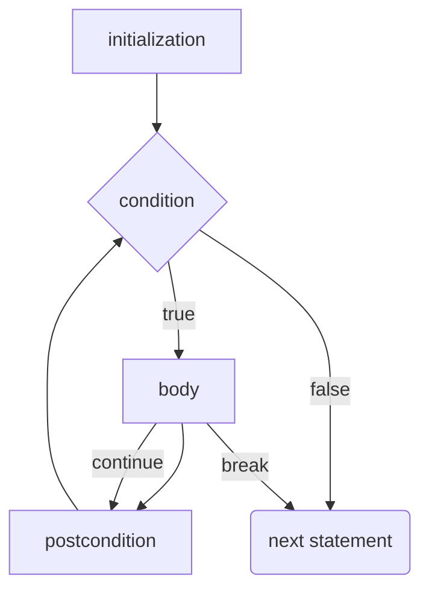

# `for` Loops
The `for` loop is a fancy form of the `while` loop. Like the `while` loop, it also supports `break` and `continue` statements.

```java
for (initialization; condition; postcondition) {
	// body
}
```

`condition` is a `boolean` expression. `initialization` and `postcondition` are statements.



