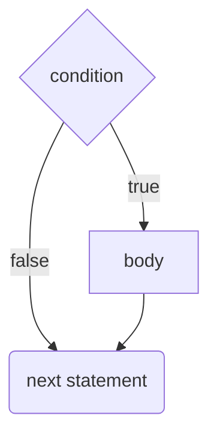
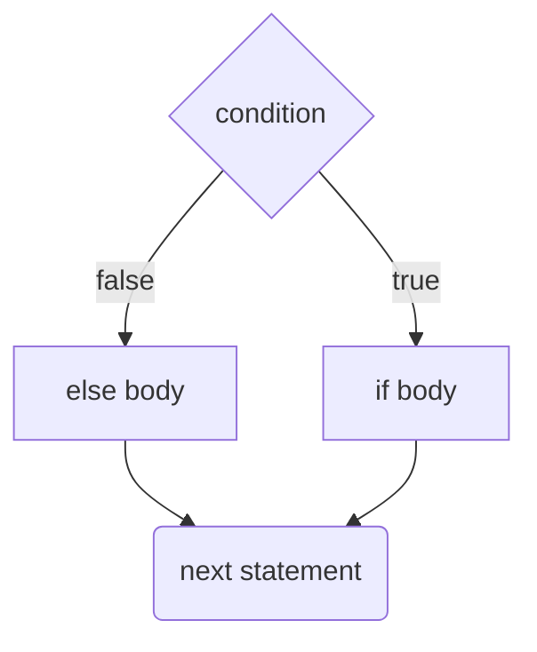
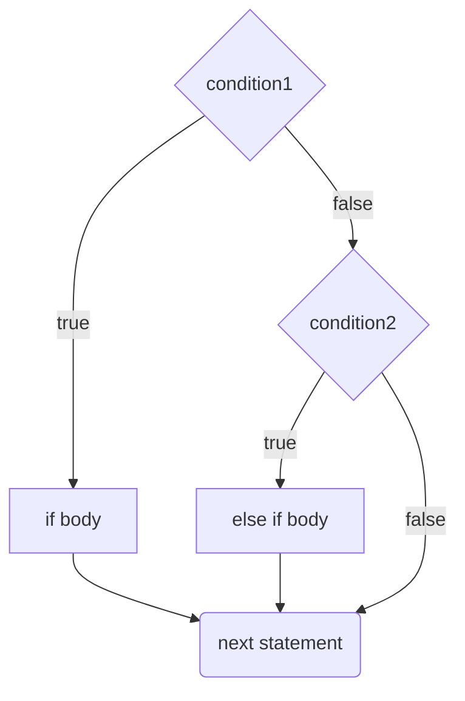

# `if` Statements
An `if` statement executes some set of statements if a given condition is true.

```java
if (condition) {
	// body
}
// next statement
```




## `else` Clauses
An `else` clause is executed if the condition of the associated `if` statement is false.

```java
if (condition) {
	// if body
} else {
	// else body
}
// next statement
```



## `else if` Clauses
An `else if` clause is executed if the condition of the associated `if`
statement is false and the condition of the `else if` clause is true.

```java
if (condition1) {
	// if body
} else if (condition2) {
	// else if body
}
```



You can chain `else if`s and optionally end in an `else`.

```java
if (condition1) {
	// executed if condition1 is true
} else if (condition2) {
	// executed if condition1 is false and condition2 is true
} else if (condition3) {
	// executed if condition1 and condition2 are false and condition3 is true
} else {
	// executed if condition1, condition2, and condition3 are false
}
```


